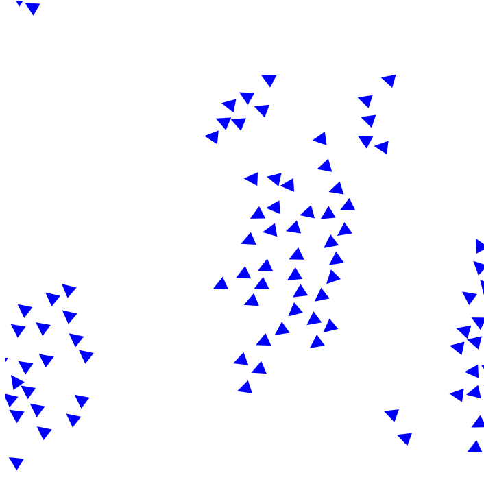

# Boids implemented in Typescript and SVG.js

This is a simple implementation of the [Boids](https://www.red3d.com/cwr/boids/) algorithm in Typescript and [SVG.js](https://svgjs.com/docs/3.0/) . It is based on the implementation of Daniel Shiffman in [The Nature of Code](https://natureofcode.com/autonomous-agents/#flocking).

[Vite](https://vitejs.dev/) is used as a bundler and dev server.



## Installation

```bash
npm install
```

## Usage

```bash
npm run dev
```

## Resources

- [Boids](https://www.red3d.com/cwr/boids/)
- [The Nature of Code](https://natureofcode.com/autonomous-agents/#flocking)
- [SVG.js](https://svgjs.dev/docs/3.0/)
- [Vite](https://vitejs.dev/)
